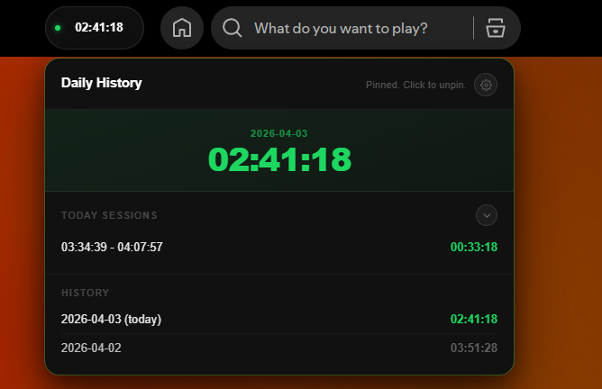

Хотите прочитать на английском? Нажмите [сюда](./README.md).

# Daily Time Tracker для Spicetify

Расширение считает, сколько времени вы слушаете Spotify каждый день, и показывает таймер в верхней панели.

> [!NOTE]
> Этот код был написан с помощью ChatGPT.



## Возможности

- **Таймер в верхней панели:** Счетчик в формате `ЧЧ:ММ:СС` или `ДД:ЧЧ:ММ:СС`.
- **Умное отслеживание:** Паузы учитываются по настраиваемому порогу перед закрытием сессии.
- **Configurable Pause Threshold:** В Settings можно выбрать `15 / 30 / 60 / 120 сек`.
- **Подробная история:** Popup с сессиями за сегодня и архивом по дням.
- **Top Tracks Today:** Необязательный блок под общим временем за день, который показывает самые часто проигрываемые треки за текущий день.
- **Недельная сводка:** Отдельная кнопка `Неделя` показывает последние 7 дней, среднее, лучший день и мини-график.
- **Compact / Full Popup Modes:** Compact делает popup компактнее, Full показывает все сессии, всю историю и weekly toggle.
- **Сворачиваемые списки:** Секции Today Sessions и History автоматически сворачиваются в Compact mode.
- **Daily Goal:** В Settings можно задать дневную цель по времени прослушивания и видеть прогресс прямо в popup.
- **Срок хранения истории:** От 1 до 6 месяцев с автоматической очисткой видимого архива.
- **Огонек серии:** Счетчик серии появляется от 2+ дней подряд.
- **Streak Shields + Keep Streak:** До `4` пропущенных дней в календарном месяце могут автоматически защищать серию, а опция `Keep streak` сохраняет текущую серию без роста.
- **Длинная прогрессия серии:** Дополнительные цветовые уровни для длинных streak.
- **Экспорт в CSV / JSON:** Выгрузка всей сохраненной истории и текущего дня из Settings.
- **Импорт из JSON:** Восстановление или объединение предыдущего JSON-экспорта с предпросмотром и валидацией.
- **Очистка и сброс:** Сбросить сегодня, очистить историю или сделать полный сброс с подтверждением.
- **Переключение языка:** `RU` и `EN` прямо в popup.
- **Пользовательские бейджи:** Необязательный серверный бейдж рядом с заголовком popup.
- **Удаленные обновления runtime:** Marketplace-лоадер подтягивает основной код с `https://vvertax.site/dtt/ext/main.mjs` и проверяет обновления через `https://vvertax.site/dtt/ext/version.json`.

## Текущий интерфейс

- **Виджет в верхней панели:** Показывает текущее время за сегодня.
- **Шапка popup:** Заголовок, необязательный бейдж, огонек серии, mode-aware кнопка `Неделя` и кнопка Settings.
- **Основные секции:** Compact mode показывает сокращенный Today view, а Full mode открывает полный список сессий, полную историю, необязательный блок top tracks и недельную сводку.
- **Панель Settings:** Язык, режим popup, переключатель top tracks, количество top tracks, порог паузы, щиты серии, `Keep streak`, daily goal, срок хранения истории, длинная прогрессия серии, экспорт, импорт, действия сброса и текст версии.

## Установка

### Через Spicetify Marketplace

1. Откройте Spicetify Marketplace.
2. Найдите `Daily Time Tracker` во вкладке **Extensions**.
3. Нажмите **Install**.

### Ручная установка

1. Скачайте `DailyTimeTracker.js` [здесь](marketplace/DailyTimeTracker.js).
2. Поместите файл в папку расширений Spicetify:
   `%AppData%\spicetify\Extensions` на Windows или `~/.config/spicetify/Extensions` на Linux/macOS.
3. Выполните:

```powershell
spicetify config extensions DailyTimeTracker.js
spicetify apply
```

## Какие данные хранятся

Расширение использует `Spicetify.LocalStorage`:

- `dtt_today_v3`
- `dtt_sessions_v1`
- `dtt_history_v2`
- `dtt_language_v1`
- `dtt_daily_goal_seconds_v1`
- `dtt_history_retention_months_v1`
- `dtt_history_retention_forever_v1`
- `dtt_popup_mode_v1`
- `dtt_pause_threshold_seconds_v1`
- `dtt_streak_v1`
- `dtt_streak_control_v1`
- `dtt_long_streak_progression_enabled_v1`
- `dtt_badge_visibility_v1`
- `dtt_session_track_counts_v1`
- `dtt_top_tracks_visible_v1`
- `dtt_top_tracks_display_count_v1`
- `dtt_channel_v1`
- `dtt_test_notice_seen_v1`
- `dtt_version_v1`

## Примечания

- Очистка истории затрагивает видимый архив, но серия все равно считается по сырым данным истории.
- Архитектура с удаленным runtime позволяет выпускать обновления быстрее, без ожидания Marketplace review.
- Расширение зависит от DOM-структуры Spotify и Spicetify, поэтому изменения в интерфейсе Spotify могут потребовать фиксов.

## Roadmap

Смотрите [Roadmap](./ROADMAP-Rus.md).

## Лицензия

Смотрите [`LICENSE`](./LICENSE).
